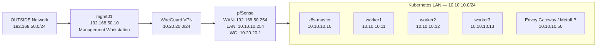

# Kubernetes + pfSense + WireGuard Homelab

## Overview

A security-focused homelab built to explore Kubernetes platform engineering, network segmentation, and secure remote administration.

The environment combines a kubeadm-based Kubernetes cluster, pfSense firewalling, WireGuard VPN access, Envoy Gateway, MetalLB, and a least-privilege access model running on VMware Workstation.

The project is designed as a practical platform for deploying, validating, and troubleshooting production-style infrastructure components.

## Contents

## Contents

- [Technology Stack](#technology-stack)
- [Architecture](#architecture)
- [Network Design](#network-design)
- [Kubernetes Platform](#kubernetes-platform)
- [Secure Remote Administration](#secure-remote-administration)
- [Validation](#validation)
- [Key Troubleshooting Outcomes](#key-troubleshooting-outcomes)
- [Repository Structure](#repository-structure)

## Technology Stack

### Infrastructure

- VMware Workstation
- pfSense
- Debian Linux

### Kubernetes Platform

- Kubernetes (kubeadm)
- containerd
- Calico CNI
- metrics-server
- local-path-provisioner

### Networking & Access

- WireGuard VPN
- Envoy Gateway
- Gateway API
- MetalLB

## Architecture

The lab is built around a segmented network design using pfSense as the routing, firewall, and VPN boundary.

A kubeadm-based Kubernetes cluster runs inside the LAN network, while remote administration is performed through a restricted WireGuard VPN path from a dedicated management workstation.



## Network Design

The environment uses three isolated network segments:

| Network | Purpose | Range |
|----------|----------|--------|
| OUTSIDE | External / hypervisor-facing network | `192.168.50.0/24` |
| LAN | Kubernetes cluster network | `10.10.10.0/24` |
| WG | WireGuard VPN network | `10.20.20.0/24` |

pfSense provides routing, DHCP services for the LAN segment, firewall enforcement, and WireGuard VPN termination.

Static addressing is used for Kubernetes nodes to ensure predictable cluster operation and stable service exposure.

### Kubernetes Nodes

| Node | Address |
|------|------|
| k8s-master | `10.10.10.10` |
| worker1 | `10.10.10.11` |
| worker2 | `10.10.10.12` |
| worker3 | `10.10.10.13` |

### Service Exposure

MetalLB provides Layer 2 load balancing for Kubernetes services.

Current ingress allocation:

| Component | Address |
|------|------|
| Envoy Gateway / MetalLB ingress | `10.10.10.50` |

## Kubernetes Platform

The Kubernetes cluster was deployed with `kubeadm` on Debian virtual machines using `containerd` as the container runtime and Calico for pod networking.

The cluster consists of one control plane node and three worker nodes.

| Role | Nodes |
|------|------|
| Control plane | `k8s-master` |
| Workers | `worker1`, `worker2`, `worker3` |

### Installed Platform Components

| Component | Purpose |
|----------|----------|
| Calico | Kubernetes pod networking |
| CoreDNS | Cluster DNS |
| metrics-server | Resource metrics for nodes and pods |
| local-path-provisioner | Lightweight persistent storage |
| MetalLB | LoadBalancer support for bare-metal Kubernetes |
| Envoy Gateway | Gateway API implementation and ingress traffic handling |

The cluster is fully operational, with all nodes in a `Ready` state and core platform components running successfully.

## Secure Remote Administration

Remote administration is provided through a WireGuard VPN terminated on pfSense.

Administrative access follows a least-privilege model based on explicit allow rules, network aliases, and restricted routing.

The management workstation (`mgmt01`) connects through the VPN network and is permitted to access only approved management targets.

### Allowed VPN Access

| Target | Purpose |
|------|------|
| `10.10.10.254` | pfSense LAN GUI |
| `10.10.10.10` | Kubernetes control plane administration |
| `10.10.10.50` | Envoy Gateway / MetalLB ingress testing |

Access to Kubernetes worker nodes and the remainder of the LAN segment is intentionally blocked.

The WAN interface is kept minimally exposed, with WireGuard acting as the primary remote administration path.

## Validation

The environment has been validated across networking, Kubernetes platform services, ingress routing, storage, and secure remote access workflows.

### Kubernetes Platform

Verified functionality:

- All cluster nodes reporting `Ready`
- CoreDNS operational
- metrics-server collecting node and pod metrics
- Persistent storage validated using PVC-backed test workloads

### Gateway & Service Exposure

Verified functionality:

- Envoy Gateway and Gateway API deployment
- HTTP routing through `HTTPRoute`
- MetalLB service exposure
- Successful ingress testing using:

```bash
curl -H "Host: app.lab.local" http://10.10.10.50/get
```

### WireGuard VPN

Verified functionality:

- Successful VPN handshake
- Route propagation through pfSense
- Automatic tunnel startup after reboot
- Restricted access model enforced

Validated remote access from `mgmt01`:

| Resource | Result |
|------|------|
| pfSense GUI | Accessible |
| Kubernetes control plane | Accessible |
| Envoy Gateway ingress | Accessible |
| Worker nodes | Blocked |
| Remaining LAN hosts | Blocked |

## Key Troubleshooting Outcomes

The project involved diagnosing and resolving several infrastructure and Kubernetes platform issues, including:

- DHCP lease conflicts and duplicate addressing related to static mappings
- Calico deployment issues caused by missing Kubernetes custom resources
- CNI plugin path mismatch affecting pod networking and CoreDNS startup
- Metrics collection issues requiring kubelet TLS compatibility adjustments
- Kubernetes storage validation using persistent test workloads

Troubleshooting and implementation notes are documented in the supporting project documentation.

## Repository Structure

```text
.
├── README.md
├── docs/
│   ├── architecture.md
│   ├── networking.md
│   ├── security.md
│   ├── kubernetes.md
│   └── troubleshooting.md
├── diagrams/
├── manifests/
├── configs/
└── screenshots/
```

Supporting documentation, diagrams, manifests, and sanitised configuration examples are organised separately to keep the main README concise and easy to review.
