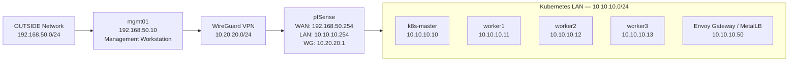

# Kubernetes + pfSense + WireGuard Homelab

## Overview

A security-focused homelab built to explore Kubernetes platform engineering, network segmentation, and secure remote administration.

The environment combines a kubeadm-based Kubernetes cluster, pfSense firewalling, WireGuard VPN access, Envoy Gateway, MetalLB, and a least-privilege access model running on VMware Workstation.

The project is designed as a practical platform for deploying, validating, and troubleshooting production-style infrastructure components.

## Technology Stack

### Infrastructure

- VMware Workstation
- pfSense
- Debian Linux

### Kubernetes Platform

- Kubernetes (kubeadm)
- containerd
- Calico CNI
- metrics-server
- local-path-provisioner

### Networking & Access

- WireGuard VPN
- Envoy Gateway
- Gateway API
- MetalLB

## Architecture

The lab is built around a segmented network design using pfSense as the routing, firewall, and VPN boundary.

A kubeadm-based Kubernetes cluster runs inside the LAN network, while remote administration is performed through a restricted WireGuard VPN path from a dedicated management workstation.

