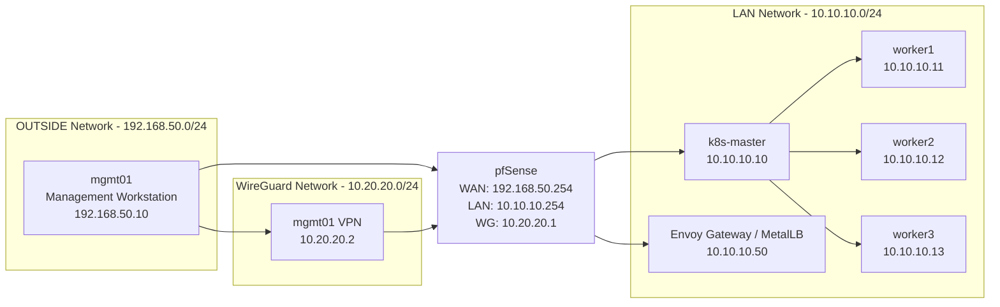

# Diagrams

## Topology

```mermaid
flowchart LR

    subgraph OUTSIDE_NETWORK["OUTSIDE Network - 192.168.50.0/24"]
        MGMT["mgmt01<br>Management Workstation<br>192.168.50.10"]
    end

    PFSENSE["pfSense<br>WAN: 192.168.50.254<br>LAN: 10.10.10.254<br>WG: 10.20.20.1"]

    subgraph WIREGUARD_NETWORK["WireGuard Network - 10.20.20.0/24"]
        VPNCLIENT["mgmt01 VPN<br>10.20.20.2"]
    end

    subgraph LAN_NETWORK["LAN Network - 10.10.10.0/24"]
        MASTER["k8s-master<br>10.10.10.10"]
        W1["worker1<br>10.10.10.11"]
        W2["worker2<br>10.10.10.12"]
        W3["worker3<br>10.10.10.13"]
        INGRESS["Envoy Gateway / MetalLB<br>10.10.10.50"]
    end

    MGMT --> PFSENSE
    MGMT --> VPNCLIENT
    VPNCLIENT --> PFSENSE
    PFSENSE --> MASTER
    PFSENSE --> INGRESS
    MASTER --> W1
    MASTER --> W2
    MASTER --> W3
```
