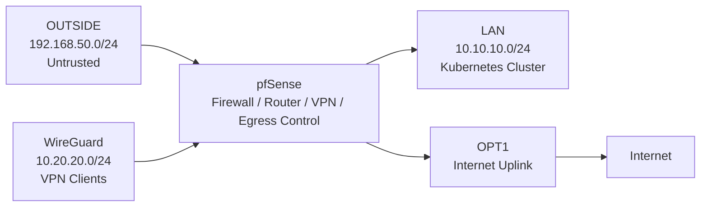

# Security Model

## Contents

- [Security Boundaries](#security-boundaries)
- [Firewall Policy](#firewall-policy)
- [WireGuard Least-Privilege Access](#wireguard-least-privilege-access)
- [Security Validation](#security-validation)

## Overview

The lab follows a least-privilege access-control model centred around pfSense firewalling, WireGuard VPN access, and controlled administrative reachability.

Remote access to internal LAN resources is intentionally restricted to approved management targets, while Internet egress from the VPN client is routed separately through pfSense using the OPT1 uplink.

The design focuses on:

- minimal WAN / OUTSIDE exposure
- explicit allow rules
- segmented network boundaries
- restricted internal VPN access
- controlled full-tunnel Internet egress
- controlled administrative access

## Security Boundaries

The environment is segmented into dedicated security zones separated by pfSense.

| Network / Interface | Role | Trust Level |
|------|------|------|
| OUTSIDE | External / hypervisor-facing network | Untrusted |
| LAN | Kubernetes cluster network | Internal |
| WG | WireGuard VPN network | Restricted administrative access |
| OPT1 | Internet uplink for VPN egress | External egress |

pfSense acts as the routing, firewall, VPN, and egress-control boundary between these segments.



## Firewall Policy

The firewall model follows a default-deny approach for internal access, with administrative reachability granted only where explicitly required.

Internet egress from the VPN client is handled separately through controlled firewall policy and outbound NAT via OPT1.

### WAN / OUTSIDE Exposure

The WAN / OUTSIDE interface is intentionally kept minimally exposed.

WireGuard is used as the primary remote administration mechanism, avoiding direct administrative exposure of internal services to the external network.

The active WAN / OUTSIDE policy permits:

| Source | Destination | Protocol | Purpose |
|------|------|------|------|
| `192.168.50.10` | pfSense WAN address | UDP 51820 | WireGuard VPN access |

### Controlled Internet Egress

WireGuard is configured in full-tunnel mode on `mgmt01`.

Internet traffic from the VPN client is routed through pfSense and exits via the OPT1 uplink.

```text
mgmt01 → WireGuard → pfSense → OPT1 → Internet
```

Internet egress is permitted through explicit firewall rules for required outbound services.

| Protocol | Ports | Purpose |
|------|------|------|
| TCP/UDP | `53` | DNS |
| TCP | `80` | HTTP |
| TCP | `443` | HTTPS |
| UDP | `123` | NTP |
| ICMP | optional | Connectivity testing |

Outbound NAT translates traffic from the WireGuard subnet through the OPT1 interface.

| Interface | Source | Destination | Translation |
|------|------|------|------|
| OPT1 | `10.20.20.0/24` | any | OPT1 address |

### Administrative Access Model

Administrative traffic to internal lab resources is routed through the WireGuard tunnel and evaluated by pfSense firewall policy before reaching the LAN.

This design allows management access without exposing the Kubernetes environment or internal LAN services directly through the WAN / OUTSIDE interface.

Internal VPN access is restricted to approved management targets, while Internet egress is handled separately through OPT1.

## WireGuard Least-Privilege Access

WireGuard access to internal lab resources is restricted using pfSense firewall policy, aliases, and constrained destination rules.

Although `mgmt01` uses full-tunnel routing for Internet egress, access to the internal LAN remains limited to explicitly approved administrative targets.

### Approved Management Targets

| Alias | Resource | Address |
|------|------|------|
| `K8S_ADMIN` | Kubernetes control plane | `10.10.10.10` |
| `K8S_INGRESS` | Envoy Gateway / MetalLB ingress | `10.10.10.50` |
| `PFSENSE_GUI` | pfSense administrative interface | `10.10.10.254` |
| `PFSENSE_WG` | WireGuard endpoint | `10.20.20.1` |

These targets are grouped through pfSense aliases and enforced by a dedicated WireGuard firewall policy.

### VPN Reachability Model

Validated internal access from `mgmt01` (`10.20.20.2`):

| Resource | Result |
|------|------|
| pfSense GUI | Allowed |
| Kubernetes control plane | Allowed |
| Envoy Gateway ingress | Allowed |
| worker1 | Blocked |
| worker2 | Blocked |
| worker3 | Blocked |
| Remaining LAN hosts | Blocked |

This confirms that VPN access to internal LAN resources remains restricted to approved management targets.

### Full-Tunnel Routing with Restricted Internal Access

The WireGuard client uses full-tunnel routing:

```ini
AllowedIPs = 0.0.0.0/0
```

This sends client Internet traffic through pfSense.

Internal LAN access is still restricted by pfSense firewall policy and aliases, so full-tunnel routing does not provide broad access to the Kubernetes LAN.

### Administrative Workflow

Worker nodes are not directly reachable from the VPN network.

Administrative access is performed through the Kubernetes control plane node, allowing cluster management without exposing worker nodes to remote VPN clients.

### Restricted Routing

WireGuard peer configuration uses constrained route definitions (`AllowedIPs`) to limit reachable destinations.

Only approved administrative resources are advertised through the tunnel rather than the full LAN network.

This approach reinforces least-privilege access at both the routing and firewall layers.

## Security Validation

The access-control model has been validated through practical administration, connectivity, and Internet egress testing.

Verified behaviour:

| Test | Result |
|------|------|
| WireGuard tunnel establishment | Successful |
| VPN routing through pfSense | Successful |
| Full-tunnel Internet routing through WireGuard | Successful |
| OPT1 Internet egress | Successful |
| Outbound NAT for WireGuard subnet | Successful |
| pfSense GUI access from VPN | Successful |
| Kubernetes control plane access from VPN | Successful |
| Envoy Gateway ingress access from VPN | Successful |
| Direct worker node access from VPN | Blocked |
| General LAN access from VPN | Blocked |

The validated behaviour confirms that remote administration remains functional, Internet egress is available through pfSense, and internal LAN access remains protected by segmented least-privilege controls.
