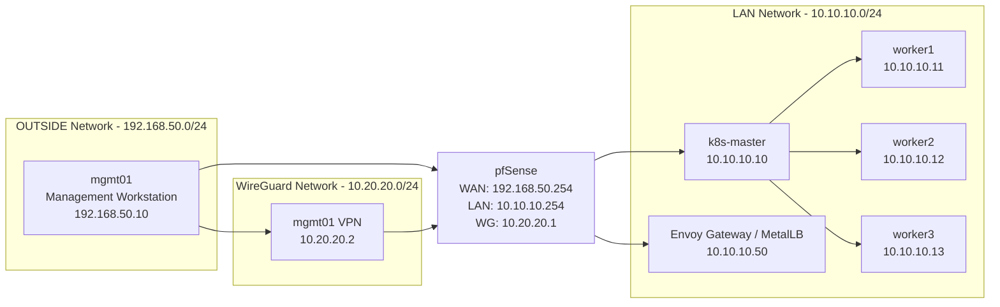
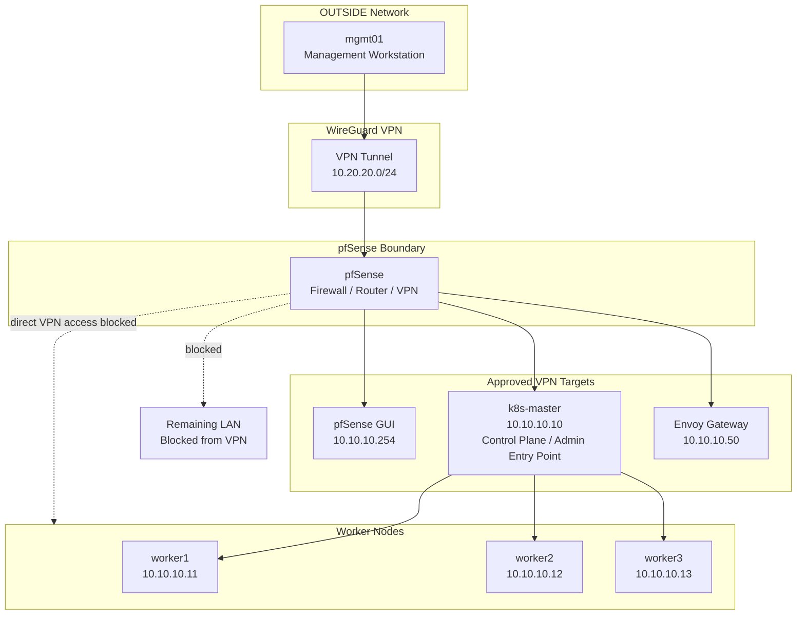

# Architecture

## Overview

This document describes the high-level architecture of the Kubernetes, pfSense, and WireGuard homelab.

The environment is designed around segmented networking, controlled administrative access, and a self-managed Kubernetes platform running on VMware Workstation.

pfSense provides the core network boundary, while Kubernetes platform services are exposed internally through MetalLB and Envoy Gateway.

## Contents

- [High-Level Architecture](#high-level-architecture)
- [Infrastructure Components](#infrastructure-components)
- [Network Architecture](#network-architecture)
- [Kubernetes Architecture](#kubernetes-architecture)
- [Administration Flow](#administration-flow)
- [Architecture Validation](#architecture-validation)

## High-Level Architecture

The lab is built around pfSense as the central routing, firewall, and VPN component.

Kubernetes nodes run inside the LAN segment, while the management workstation connects through WireGuard for restricted administrative access.

## Infrastructure Components

The lab runs on VMware Workstation and is composed of dedicated virtual machines for firewalling, management, and Kubernetes workloads.

| Component | Role |
|------|------|
| VMware Workstation | Local hypervisor platform |
| pfSense | Router, firewall, DHCP server, and WireGuard VPN endpoint |
| mgmt01 | External management workstation and VPN client |
| k8s-master | Kubernetes control plane node |
| worker1 | Kubernetes worker node |
| worker2 | Kubernetes worker node |
| worker3 | Kubernetes worker node |

This separation keeps network control, administration, and Kubernetes workloads clearly defined across the environment.

## Network Architecture

The environment uses three primary network segments.

| Network | Address Range | Purpose |
|------|------|------|
| OUTSIDE | `192.168.50.0/24` | External / hypervisor-facing network |
| LAN | `10.10.10.0/24` | Kubernetes cluster network |
| WG | `10.20.20.0/24` | WireGuard administrative network |

pfSense routes traffic between these segments and enforces firewall policy at the network boundaries.

Kubernetes services are exposed inside the LAN network using MetalLB, with the current Envoy Gateway ingress address allocated as `10.10.10.50`.

More detailed routing, service exposure, and traffic flow notes are covered in [Networking Design](networking.md).

## Kubernetes Architecture

The Kubernetes platform is deployed with `kubeadm` on Debian virtual machines using `containerd` as the container runtime.

The cluster consists of one control plane node and three worker nodes.

| Layer | Component |
|------|------|
| Control plane | `k8s-master` |
| Worker nodes | `worker1`, `worker2`, `worker3` |
| Container runtime | `containerd` |
| Pod networking | Calico |
| DNS | CoreDNS |
| Metrics | metrics-server |
| Storage | local-path-provisioner |
| Service exposure | MetalLB |
| Ingress / Gateway | Envoy Gateway + Gateway API |

The platform supports core Kubernetes workflows including workload scheduling, pod networking, persistent storage, resource metrics, and HTTP ingress routing.

More detailed Kubernetes platform notes are covered in [Kubernetes Platform](kubernetes.md).

## Administration Flow

Remote administration is performed from `mgmt01` through a WireGuard VPN tunnel terminated on pfSense.

The VPN client is not granted broad LAN access. Instead, access is restricted to approved management targets. Worker nodes are managed through the Kubernetes control plane node rather than being directly reachable from the VPN network.

This model allows remote administration of the cluster while keeping worker nodes and the wider LAN inaccessible directly from the VPN network.

Worker administration is performed through the Kubernetes control plane node, preserving the restricted access model while still allowing practical cluster management.

More detailed firewall and VPN notes are covered in [Security Model](security.md).

## Architecture Validation

The architecture has been validated across infrastructure, networking, Kubernetes platform services, ingress routing, and secure remote administration.

| Area | Validation |
|------|------|
| Network segmentation | OUTSIDE, LAN, and WG networks separated through pfSense |
| Routing | pfSense routing operational between required segments |
| Kubernetes cluster | All nodes reporting `Ready` |
| Pod networking | Calico operational |
| Service exposure | MetalLB assigning ingress address from LAN pool |
| Gateway routing | Envoy Gateway routing traffic through Gateway API resources |
| VPN administration | WireGuard tunnel established from `mgmt01` |
| Access control | VPN access restricted to approved management targets |

The validated architecture provides a working self-managed Kubernetes environment with controlled service exposure and restricted administrative access.
