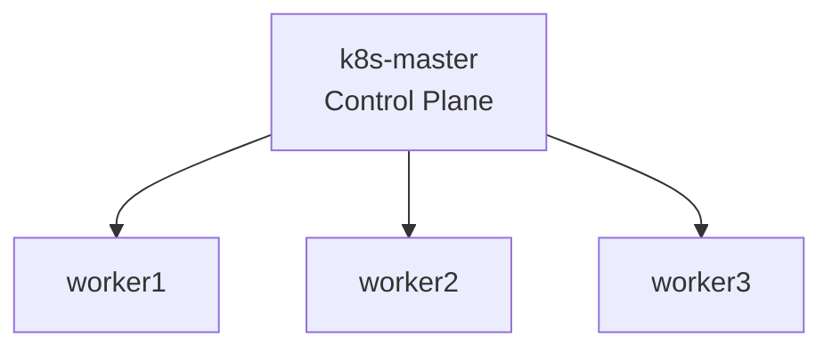

# Kubernetes Platform

## Overview

The Kubernetes platform is built using kubeadm on Debian virtual machines with containerd as the container runtime.

The environment is designed to provide a practical platform for cluster deployment, networking, service exposure, observability, and storage validation within a self-managed infrastructure model.

## Contents

- [Cluster Topology](#cluster-topology)
- [Cluster Deployment](#cluster-deployment)
- [Core Platform Components](#core-platform-components)
- [Storage](#storage)
- [Observability](#observability)
- [Gateway & Ingress Components](#gateway--ingress-components)
- [Platform Validation](#platform-validation)

## Cluster Topology

The cluster consists of one control plane node and three worker nodes deployed on Debian virtual machines.

| Role | Node | Address |
|------|------|------|
| Control plane | `k8s-master` | `10.10.10.10` |
| Worker | `worker1` | `10.10.10.11` |
| Worker | `worker2` | `10.10.10.12` |
| Worker | `worker3` | `10.10.10.13` |

The platform is deployed using a traditional kubeadm control plane and worker model suitable for self-managed Kubernetes environments.

