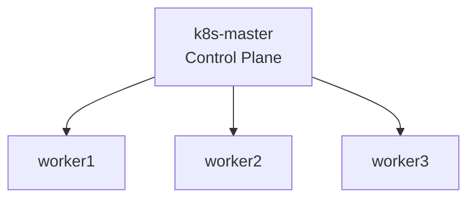

# Kubernetes Platform

## Overview

The Kubernetes platform is built using kubeadm on Debian virtual machines with containerd as the container runtime.

The environment is designed to provide a practical platform for cluster deployment, networking, service exposure, observability, and storage validation within a self-managed infrastructure model.

## Contents

- [Cluster Topology](#cluster-topology)
- [Cluster Deployment](#cluster-deployment)
- [Core Platform Components](#core-platform-components)
- [Storage](#storage)
- [Observability](#observability)
- [Gateway & Ingress Components](#gateway--ingress-components)
- [Platform Validation](#platform-validation)

## Cluster Topology

The cluster consists of one control plane node and three worker nodes deployed on Debian virtual machines.

| Role | Node | Address |
|------|------|------|
| Control plane | `k8s-master` | `10.10.10.10` |
| Worker | `worker1` | `10.10.10.11` |
| Worker | `worker2` | `10.10.10.12` |
| Worker | `worker3` | `10.10.10.13` |



The platform is deployed using a traditional kubeadm control plane and worker model suitable for self-managed Kubernetes environments.

## Cluster Deployment

The cluster was deployed using `kubeadm` on Debian virtual machines.

`containerd` is used as the container runtime with `SystemdCgroup` enabled to align container runtime behaviour with Kubernetes recommendations.

### Platform Components

| Component | Implementation |
|------|------|
| Operating System | Debian |
| Kubernetes Deployment | kubeadm |
| Container Runtime | containerd |
| Pod Networking | Calico |
| Cluster DNS | CoreDNS |

The deployment follows a self-managed Kubernetes model, with infrastructure components installed and validated individually during platform bring-up.

## Core Platform Components

Several supporting components were installed to provide networking, DNS, metrics, and service exposure capabilities.

| Component | Purpose | Status |
|------|------|------|
| Calico | Pod networking | Operational |
| CoreDNS | Cluster DNS and service discovery | Operational |
| metrics-server | Node and pod resource metrics | Operational |
| MetalLB | LoadBalancer functionality | Operational |
| Envoy Gateway | Gateway API ingress implementation | Operational |

Core platform services are running successfully across the cluster and support networking, observability, and ingress workflows.

## Storage

Persistent storage is provided using `local-path-provisioner`.

This provides a lightweight storage layer suitable for lab workloads and persistent volume testing in a self-managed Kubernetes environment.

Storage validation included:

- StorageClass availability
- PVC creation
- test Pod deployment
- persistent write verification

This confirmed that workloads can request and use persistent storage successfully within the cluster.

## Observability

Cluster resource metrics are provided through `metrics-server`.

The deployment enables visibility into node and workload resource consumption through standard Kubernetes tooling.

Validated functionality:

```bash
kubectl top nodes
kubectl top pods -A
```

Deployment adjustments were applied to ensure compatibility between metrics-server and kubelet TLS behaviour within the lab environment.

