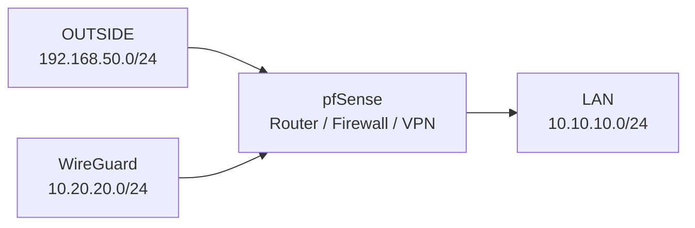

# Networking Design

## Overview

The lab networking model is built around segmented network boundaries, controlled routing, and service exposure suitable for a self-managed Kubernetes environment.

pfSense provides routing, firewalling, DHCP services, and VPN termination, while Kubernetes networking is handled through Calico, MetalLB, and Envoy Gateway.

## Contents

- [Network Segments](#network-segments)
- [Routing Model](#routing-model)
- [Kubernetes Networking](#kubernetes-networking)
- [MetalLB Service Exposure](#metallb-service-exposure)
- [Gateway & Traffic Flow](#gateway--traffic-flow)
- [Network Validation](#network-validation)

## Network Segments

The environment uses three dedicated network segments with distinct operational roles.

| Network | Purpose | Address Range |
|------|------|------|
| OUTSIDE | External / hypervisor-facing network | `192.168.50.0/24` |
| LAN | Kubernetes cluster network | `10.10.10.0/24` |
| WG | WireGuard administrative network | `10.20.20.0/24` |

pfSense provides the network boundary between these segments and controls routing, firewall enforcement, and VPN connectivity.



## Routing Model

pfSense acts as the central routing point for the lab environment.

### Interface Configuration

| Interface | Address |
|------|------|
| WAN / OUTSIDE | `192.168.50.254` |
| LAN | `10.10.10.254` |
| WireGuard | `10.20.20.1` |

### DHCP & Static Addressing

LAN DHCP is provided by pfSense.

Static mappings are used for Kubernetes infrastructure nodes to maintain predictable addressing and stable cluster behaviour.

| Node | Address |
|------|------|
| k8s-master | `10.10.10.10` |
| worker1 | `10.10.10.11` |
| worker2 | `10.10.10.12` |
| worker3 | `10.10.10.13` |

### Administrative Traffic Path

The management workstation (`mgmt01`) operates from the OUTSIDE network (`192.168.50.10`).

Administrative traffic follows the path:

```text
mgmt01 → WireGuard VPN → pfSense → approved internal resources
```

This routing model allows secure remote administration while keeping internal Kubernetes services isolated from direct external access.

## Kubernetes Networking

Kubernetes pod networking is provided by Calico.

Calico enables pod-to-pod communication across the Debian cluster nodes and integrates with the kubeadm-based cluster deployment.

CoreDNS is running successfully and provides internal Kubernetes service discovery.

### Container Networking Interface

The cluster uses the standard Kubernetes CNI model for pod networking.

During deployment, a CNI plugin path mismatch was identified and resolved by aligning the expected CNI binary location with the installed plugin path.

This restored pod networking and allowed CoreDNS and other cluster workloads to start correctly.
