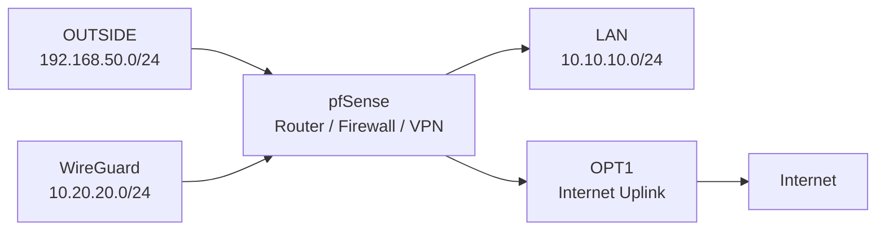
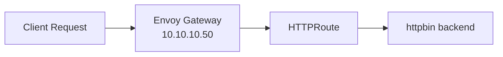

# Networking Design

## Overview

The lab networking model is built around segmented network boundaries, controlled routing, and service exposure suitable for a self-managed Kubernetes environment.

pfSense provides routing, firewalling, DHCP services, WireGuard VPN termination, and controlled Internet egress through a dedicated OPT1 uplink, while Kubernetes networking is handled through Calico, MetalLB, and Envoy Gateway.

## Contents

- [Network Segments](#network-segments)
- [Routing Model](#routing-model)
- [Internet Egress via OPT1](#internet-egress-via-opt1)
- [Kubernetes Networking](#kubernetes-networking)
- [MetalLB Service Exposure](#metallb-service-exposure)
- [Gateway & Traffic Flow](#gateway--traffic-flow)
- [Network Validation](#network-validation)

## Network Segments

The environment uses three dedicated network segments with distinct operational roles, plus an OPT1 uplink for controlled Internet egress.

| Network / Interface | Purpose | Address Range |
|------|------|------|
| OUTSIDE | External / hypervisor-facing network | `192.168.50.0/24` |
| LAN | Kubernetes cluster network | `10.10.10.0/24` |
| WG | WireGuard administrative and full-tunnel VPN network | `10.20.20.0/24` |
| OPT1 | Internet uplink for VPN egress | DHCP |

pfSense provides the network boundary between these segments and controls routing, firewall enforcement, VPN connectivity, and Internet egress through OPT1.



## Routing Model

pfSense acts as the central routing point for the lab environment.

### Interface Configuration

| Interface | Address |
|------|------|
| WAN / OUTSIDE | `192.168.50.254` |
| LAN | `10.10.10.254` |
| WireGuard | `10.20.20.1` |
| OPT1 | DHCP Internet uplink |

### DHCP & Static Addressing

LAN DHCP is provided by pfSense.

Static mappings are used for Kubernetes infrastructure nodes to maintain predictable addressing and stable cluster behaviour.

| Node | Address |
|------|------|
| k8s-master | `10.10.10.10` |
| worker1 | `10.10.10.11` |
| worker2 | `10.10.10.12` |
| worker3 | `10.10.10.13` |

### Administrative Traffic Path

The management workstation (`mgmt01`) operates from the OUTSIDE network (`192.168.50.10`).

Administrative traffic follows the path:

```text
mgmt01 → WireGuard VPN → pfSense → approved internal resources
mgmt01 → WireGuard VPN → pfSense → OPT1 → Internet
```

This routing model allows secure remote administration of selected internal resources while also supporting full-tunnel Internet egress from the management workstation through pfSense.

## Internet Egress via OPT1

WireGuard is configured in full-tunnel mode on `mgmt01`, with VPN client Internet traffic routed through pfSense.

The Internet egress path is:

```text
mgmt01 → WireGuard → pfSense → OPT1 → Internet
```

### WireGuard Full-Tunnel Routing

On `mgmt01`, WireGuard uses full-tunnel routing:

```ini
AllowedIPs = 0.0.0.0/0
```

This routes client Internet traffic through the VPN tunnel rather than directly through the local network.

### pfSense Default Gateway

pfSense uses the OPT1 DHCP gateway as the default gateway for Internet egress.

```text
Default Gateway = OPT1_DHCP
```

This ensures VPN client Internet traffic exits through the real Internet uplink rather than the lab OUTSIDE network.

### Outbound NAT

Outbound NAT is required for WireGuard client traffic to reach the Internet through OPT1.

The lab uses Hybrid Outbound NAT with a rule for the WireGuard subnet:

| Interface | Source | Destination | Translation |
|------|------|------|------|
| OPT1 | `10.20.20.0/24` | any | OPT1 address |

Without this NAT rule, WireGuard access to internal LAN resources works, but Internet egress from the VPN client fails.

### Controlled Egress Policy

VPN client Internet access is allowed only for required outbound traffic.

| Protocol | Ports | Purpose |
|------|------|------|
| TCP/UDP | `53` | DNS |
| TCP | `80` | HTTP |
| TCP | `443` | HTTPS |
| UDP | `123` | NTP |
| ICMP | optional | Connectivity testing |

Internal LAN access remains restricted separately through pfSense firewall rules and aliases.

## Kubernetes Networking

Kubernetes pod networking is provided by Calico.

Calico enables pod-to-pod communication across the Debian cluster nodes and integrates with the kubeadm-based cluster deployment.

CoreDNS is running successfully and provides internal Kubernetes service discovery.

### Container Networking Interface

The cluster uses the standard Kubernetes CNI model for pod networking.

During deployment, a CNI plugin path mismatch was identified and resolved by aligning the expected CNI binary location with the installed plugin path.

This restored pod networking and allowed CoreDNS and other cluster workloads to start correctly.

## MetalLB Service Exposure

MetalLB provides `LoadBalancer` functionality for the self-managed Kubernetes environment.

A dedicated address pool is allocated from the LAN network for service exposure.

### Address Pool

| Component | Range |
|------|------|
| MetalLB IP Pool | `10.10.10.50 – 10.10.10.60` |

### Current Ingress Allocation

| Service | Address |
|------|------|
| Envoy Gateway ingress | `10.10.10.50` |

This approach enables Kubernetes services to be exposed within the lab environment without relying on a cloud provider load balancer.

## Gateway & Traffic Flow

Ingress traffic management is implemented using Envoy Gateway and the Kubernetes Gateway API.

The deployment includes:

- GatewayClass
- Gateway
- HTTPRoute
- `httpbin` backend service

Incoming requests are routed through the Envoy Gateway ingress address exposed by MetalLB.



Validated request flow:

```bash
curl -H "Host: app.lab.local" http://10.10.10.50/get
```

Successful responses confirm correct integration between MetalLB, Envoy Gateway, Gateway API resources, and backend service routing.

## Network Validation

The networking model was validated through Kubernetes, service exposure, and VPN access tests.

| Area | Validation |
|------|------|
| pfSense routing | Traffic routed between defined network segments |
| LAN DHCP | Kubernetes nodes received expected static mappings |
| WireGuard internal access | VPN traffic routed through pfSense to approved internal targets |
| WireGuard full tunnel | `mgmt01` routed Internet traffic through the VPN |
| OPT1 egress | Full-tunnel VPN traffic exited through pfSense OPT1 |
| Outbound NAT | WireGuard subnet translated through the OPT1 interface |
| Internet through VPN | Internet access validated from `mgmt01` through WireGuard |
| Calico | Pod networking operational across cluster nodes |
| CoreDNS | Cluster service discovery operational |
| MetalLB | LoadBalancer IP assigned from the LAN pool |
| Envoy Gateway | HTTP traffic routed to backend service |

The validation confirms that the lab network supports Kubernetes operations, controlled service exposure, restricted internal administration, and full-tunnel VPN Internet egress through pfSense.
