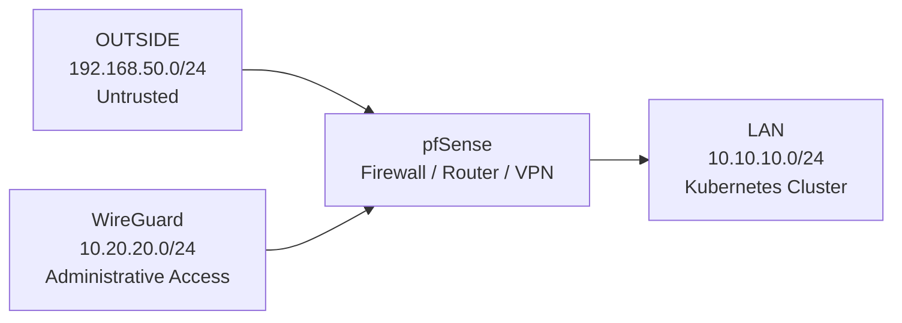

# Security Model

## Overview

The lab follows a least-privilege security model centred around pfSense firewalling, WireGuard VPN access, and controlled administrative reachability.

Remote administration is intentionally restricted to approved management targets, while unnecessary exposure between networks and systems is avoided.

The design focuses on:

- minimal WAN exposure
- explicit allow rules
- segmented network boundaries
- restricted VPN routing
- controlled administrative access

## Security Boundaries

The environment is segmented into dedicated security zones separated by pfSense.

| Network | Role | Trust Level |
|------|------|------|
| OUTSIDE | External / hypervisor-facing network | Untrusted |
| LAN | Kubernetes cluster network | Internal |
| WG | WireGuard administrative network | Restricted administrative access |

pfSense acts as the routing, firewall, and VPN boundary between these segments.

