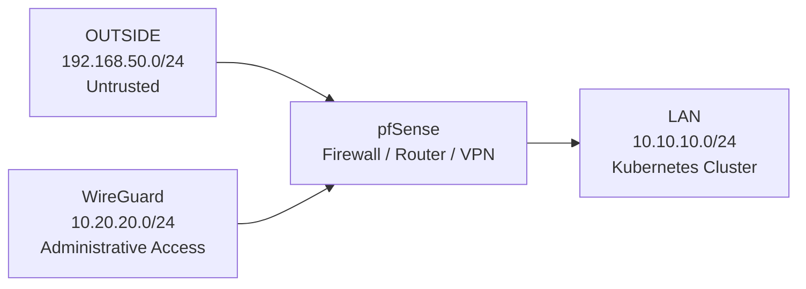

# Security Model

## Overview

The lab follows a least-privilege security model centred around pfSense firewalling, WireGuard VPN access, and controlled administrative reachability.

Remote administration is intentionally restricted to approved management targets, while unnecessary exposure between networks and systems is avoided.

The design focuses on:

- minimal WAN exposure
- explicit allow rules
- segmented network boundaries
- restricted VPN routing
- controlled administrative access

## Security Boundaries

The environment is segmented into dedicated security zones separated by pfSense.

| Network | Role | Trust Level |
|------|------|------|
| OUTSIDE | External / hypervisor-facing network | Untrusted |
| LAN | Kubernetes cluster network | Internal |
| WG | WireGuard administrative network | Restricted administrative access |

pfSense acts as the routing, firewall, and VPN boundary between these segments.

## Firewall Policy

The firewall model follows a default-deny approach, with administrative access granted only where explicitly required.

### WAN Exposure

The WAN interface is intentionally kept minimally exposed.

WireGuard is used as the primary remote administration mechanism, avoiding direct administrative exposure of internal services to the external network.

The active WAN policy permits:

| Source | Destination | Protocol | Purpose |
|------|------|------|------|
| `192.168.50.10` | pfSense WAN | UDP 51820 | WireGuard VPN access |

### Administrative Access Model

Administrative traffic is routed through the WireGuard tunnel and evaluated by pfSense firewall policy before reaching internal resources.

This design allows management access without exposing the Kubernetes environment or internal LAN services directly through the WAN interface.

## WireGuard Least-Privilege Access

WireGuard access is restricted using pfSense firewall policy, aliases, and constrained routing definitions.

Rather than granting broad LAN access, the VPN client is permitted to reach only explicitly approved administrative targets.

### Approved Management Targets

| Alias | Resource | Address |
|------|------|------|
| `K8S_ADMIN` | Kubernetes control plane | `10.10.10.10` |
| `K8S_INGRESS` | Envoy Gateway / MetalLB ingress | `10.10.10.50` |
| `PFSENSE_GUI` | pfSense administrative interface | `10.10.10.254` |
| `PFSENSE_WG` | WireGuard endpoint | `10.20.20.1` |

These targets are grouped through pfSense aliases and enforced by a dedicated WireGuard firewall policy.

### VPN Reachability Model

Validated access from `mgmt01` (`10.20.20.2`):

| Resource | Result |
|------|------|
| pfSense GUI | Allowed |
| Kubernetes control plane | Allowed |
| Envoy Gateway ingress | Allowed |
| worker1 | Blocked |
| worker2 | Blocked |
| worker3 | Blocked |
| Remaining LAN hosts | Blocked |

### Administrative Workflow

Worker nodes are not directly reachable from the VPN network.

Administrative access is performed through the Kubernetes control plane node, allowing cluster management without exposing worker nodes to remote VPN clients.

### Restricted Routing

WireGuard peer configuration uses constrained route definitions (`AllowedIPs`) to limit reachable destinations.

Only approved administrative resources are advertised through the tunnel rather than the full LAN network.

This approach reinforces least-privilege access at both the routing and firewall layers.
